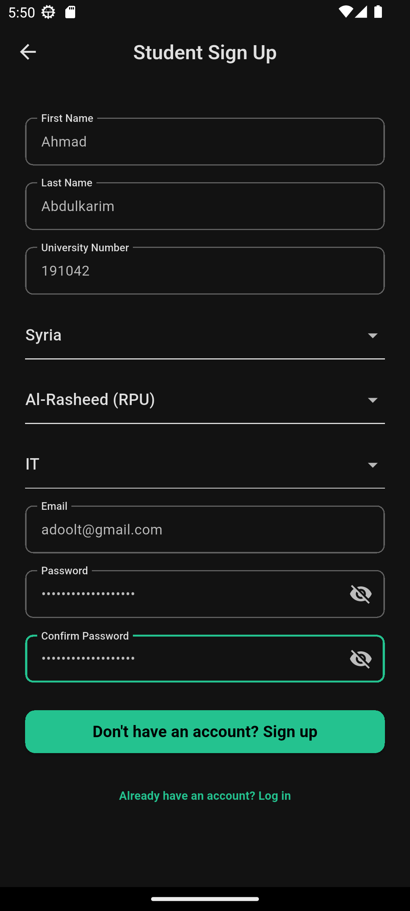
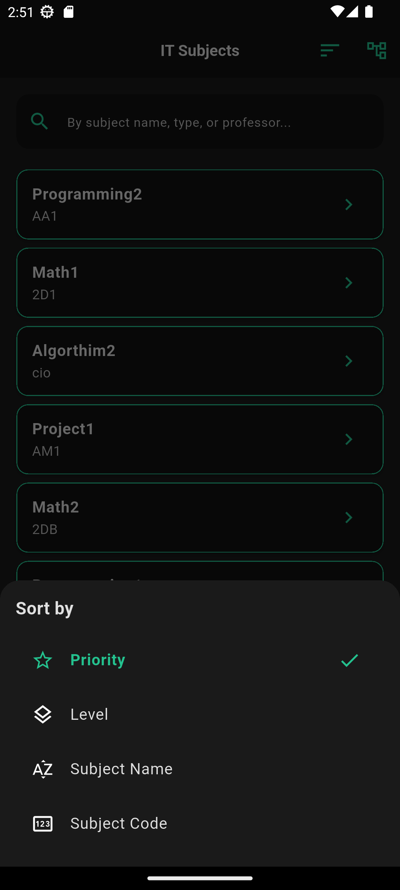

🎓 UniCurve - A Scalable, Multi-University Success Platform

<!-- IMPORTANT: This path points to your logo inside the 'assets' folder -->

<strong>An intelligent academic co-pilot designed as a scalable platform for ANY university, transforming how students plan their studies, optimize schedules, and visualize their path to graduation.</strong>

<!-- Primary Technologies -->

 
<!-- Architecture & State -->

🚀 The Problem UniCurve Solves
For any university, curriculum planning is a high-stakes puzzle. Students struggle with navigating complex prerequisite chains, avoiding timetable conflicts, and understanding the real impact of their course choices. A single mistake can lead to a delayed graduation and thousands in extra tuition.
UniCurve is built to solve this problem at scale, providing a robust, data-driven platform that any university can adopt to offer its students a clear and intelligent path to success.
✨ Core Features
🧑‍🎓 For Students: A Powerful Academic Toolkit
📈 Dynamic Curriculum Tree: An interactive, color-coded dependency graph that visually maps out the student's entire major based on their university's specific rules.
🧠 Intelligent Schedule Generation: The core of UniCurve. Our custom algorithm generates the Top 3 optimal, conflict-free schedules for the upcoming term, prioritizing critical courses to accelerate progress.
🎯 GPA Planning & Forecasting:
Term GPA Calculator: Experiment with potential grades to see their immediate impact.
Goal GPA Scenarios: Set a target GPA and receive a realistic, actionable plan to achieve it, broken down by semester.
📊 In-Depth Progress Tracking: A detailed student profile showing credit hours completed, graduation requirements met, and a full academic record.
🌐 Full Localization & Theming: Seamlessly switch between English and Arabic, and toggle between light and dark modes.
👑 For University Admins: A Multi-Tenant Control Center
🛡️ Secure, Isolated Admin Dashboard: Each university gets its own protected interface to manage its unique academic ecosystem.
📚 Full Academic Management (CRUD): Admins for a specific university have complete control to create, update, and manage their institution's data:
Majors and specific graduation requirements.
Subjects, prerequisites, and co-requisites.
Professors and course assignments.
Course schedules, sections, and term availability.
📸 App Showcase

<strong>📱 Onboarding & Authentication Screens</strong>

 
<table>
<tr>
<td align="center"><strong>Onboarding</strong> </td>
<td align="center"><strong>Login</strong> </td>
<td align="center"><strong>Student Sign Up</strong> </td>
</tr>
</table>

<strong>👨‍🎓 Student Feature Screens</strong>

 
<table>
<tr>
<td align="center"><strong>Subjects List</strong> </td>
<td align="center"><strong>Sort & Filter Subjects</strong> </td>
<td align="center"><strong>Subject Detail</strong> </td>
</tr>
<tr>
<td align="center"><strong>Curriculum Tree</strong> </td>
<td align="center"><strong>Best Subjects to Take</strong> </td>
<td align="center"><strong>Best Tables to Take</strong> </td>
</tr>
<tr>
<td align="center"><strong>Term GPA Calculator</strong> </td>
<td align="center"><strong>Goal GPA Plan</strong> </td>
<td align="center"><strong>GPA Improvement Scenarios</strong> </td>
</tr>
<tr>
<td align="center"><strong>Student Profile</strong> </td>
<td align="center"><strong>Major Requirements Progress</strong> </td>
<td align="center"><strong>Settings</strong> </td>
</tr>
</table>

<strong>👑 University Admin Screens</strong>

 
<table>
<tr>
<td align="center"><strong>Admin Dashboard</strong> </td>
<td align="center"><strong>Manage Majors</strong> </td>
<td align="center"><strong>Manage Major Requirements</strong> </td>
</tr>
<tr>
<td align="center"><strong>Manage Subjects</strong> </td>
<td align="center"><strong>Detail Subjects</strong> </td>
<td align="center"><strong>Manage Subject Relationships</strong> </td>
</tr>
<tr>
<td align="center"><strong>Manage Professors</strong> </td>
<td align="center"><strong>Add Professor</strong> </td>
<td align="center"><strong>Manage Subject Timings</strong> </td>
</tr>
<tr>
<td align="center"><strong>Admin Settings</strong> </td>
<td></td>
<td></td>
</tr>
</table>

🧠 The Core Algorithm: Intelligent Schedule Generation
The magic behind UniCurve is a custom, heuristic-based scheduling algorithm designed to navigate the complex constraints of university timetabling. It's not just a simple search; it's a strategic process.
Here's how it works:
Data Aggregation: The algorithm first gathers all necessary data from the Supabase backend:
The student's passed subjects (student_taken_subjects).
All prerequisite relationships (subject_relationships).
All currently open subjects and their available sections/groups (subjects, subject_groups).
The student's major requirements and remaining credit hours.
Dynamic Priority Scoring: It calculates a "priority score" for every available subject. This score is a combination of two factors:
Static Priority: A predefined importance set by the university admin (e.g., a critical capstone project).
Dynamic "Unlock" Score: This is the core of the strategic prioritization. The algorithm analyzes the subject_relationships table to determine how many future courses are unlocked by completing a specific subject. For example, if "Programming 2" is a prerequisite for 5 advanced courses, it receives a dynamic priority of +5. This ensures that critical "gateway" courses, which open up the most future options, are naturally pushed to the top of the recommendation list.
Recursive Backtracking Search: The algorithm begins a recursive search to build valid schedules.
It starts with an empty schedule and iterates through the prioritized list of subjects.
For each subject, it tries to fit one of its available sections (lecture, lab, etc.) into the schedule.
Conflict Detection: It instantly checks for time conflicts with any courses already in the schedule.
Intelligent Conflict Resolution & Pruning: If a conflict occurs, the algorithm doesn't just give up. It intelligently backtracks, trying different sections of previously placed courses to free up slots. This process explores thousands of potential combinations efficiently. To avoid infinite loops and maintain performance, the search is pruned after finding a sufficient number of high-quality solutions (~300).
Ranking and Optimization: Once a pool of valid schedules is generated, they are ranked based on user preference:
Default: Maximize total priority score and credit hours.
Minimize Days: Find the schedule with the highest value that fits into the fewest number of days per week.
Generating Top 3 Alternatives: To provide genuine choice, the algorithm generates the 2nd and 3rd best options by systematically excluding the least important courses from the #1 optimal schedule and re-running the search. This provides meaningful alternatives, not just minor variations.
This sophisticated approach ensures that the student is always presented with schedules that are not only conflict-free but strategically optimized for their academic progress.
🛠️ Technology Stack & Architecture
Frontend: Flutter - For a high-performance, cross-platform mobile experience from a single codebase.
Backend & Database: Supabase - Leveraged for its powerful PostgreSQL database, authentication, and instant APIs. Its row-level security is critical for the multi-tenant architecture.
Architecture: Pragmatic MVC - A clean, Model-View-Controller-like structure is used to ensure a clear separation of concerns, making the app highly maintainable and scalable.
Model: Data structures and repositories (lib/domain).
View: UI widgets and pages (lib/pages).
Controller: Business logic managed by Riverpod providers (lib/pages/.../providers).
State Management: Riverpod - Chosen for its compile-safe, declarative, and scalable approach. It enables a reactive UI and effectively decouples business logic from the widget tree, preventing common state issues.
Localization & Routing: GetX - Utilized specifically for its lightweight and efficient modules for:
Internationalization (i18n): Simple key.tr syntax for supporting English and Arabic.
Routing: Quick and easy navigation (Get.to, Get.back).

<strong>🗄️ Supabase Database Schema Overview</strong>

The backend is supported by a relational database schema designed for scalability and data integrity.
Multi-Tenancy at its Core: Most tables include a university_id, ensuring that data (subjects, majors, professors) for one university is completely isolated from another. This is the foundation of the platform's scalability.
Relational Integrity: Foreign key constraints are used extensively to maintain data consistency. For example, a subject_schedule cannot exist without a valid subject_group, which in turn cannot exist without a subject.
User Roles and Permissions: Supabase's built-in authentication and Row-Level Security (RLS) policies are used to define distinct roles (e.g., student, university_admin) and grant access only to the data they are authorized to see or modify.

<strong>📂 Project Structure</strong>

The project is organized using a hybrid architecture that combines a layered approach with feature-based modules for clarity and scalability.
Generated code
lib
├── core/               # Shared utilities, constants, themes, and extensions.
├── data/
│   └── services/       # Data layer: Repositories and services for backend communication.
├── domain/
│   └── models/         # Domain layer: Core business entities and data models.
├── onboarding/         # Feature module for the onboarding/intro flow.
├── pages/              # Contains the primary UI screens for the app's main features.
├── settings/           # Feature module for the settings screen.
└── main.dart           # The entry point of the Flutter application.
Use code with caution.
core/: Shared code, utilities, constants, theme definitions, and core extensions used across the entire application.
data/services/: The Data layer. Contains repository implementations and services that handle communication with the backend (Supabase) and other external data sources.
domain/models/: The Domain layer. Defines the core business logic and data structures (models) of the application, independent of any framework or UI.
onboarding/: A feature module containing all widgets and logic related to the user's first-time experience (e.g., splash screens, introductory slides).
pages/: Contains the primary feature screens of the app, such as the student dashboard, curriculum tree, and schedule generator.
settings/: A dedicated feature module for the user settings screen and related logic.
main.dart: The entry point of the Flutter application.

🚀 Getting Started
To run this project locally, follow these steps:
Clone the repository:
Generated bash
git clone https://github.com/your-username/unicurve.git
cd unicurve
Use code with caution.
Bash
Set up your Supabase project:
Create a new project on Supabase.
Use the SQL schema (e.g., database_schema.sql) in the project to set up your tables and RLS policies.
In your Supabase project settings (API section), find your Project URL and anon public key.
Configure Flutter:
Ensure you have the flutter_dotenv package in your pubspec.yaml.
Create a .env file in the root of the project.
Add your Supabase credentials to the .env file:
Generated code
SUPABASE_URL=YOUR_SUPABASE_URL
SUPABASE_ANON_KEY=YOUR_SUPABASE_ANON_KEY
Use code with caution.
Install dependencies and run:
Generated bash
flutter pub get
flutter run
Use code with caution.
Bash
💡 Future Work & Roadmap
UniCurve has a strong foundation with potential for many exciting features:
Push Notifications: Alert students about registration deadlines or newly opened sections.
Social Sharing: Allow students to share their generated schedules with friends.
Professor Ratings: A community-driven feature for students to rate and review professors.
Expanded Admin Analytics: Provide university admins with dashboards showing popular courses, registration bottlenecks, and student success metrics.
Web & Desktop Support: Expand the platform beyond mobile using Flutter's cross-platform capabilities.
📄 License
This project is licensed under the MIT License. See the LICENSE.md file for details.
